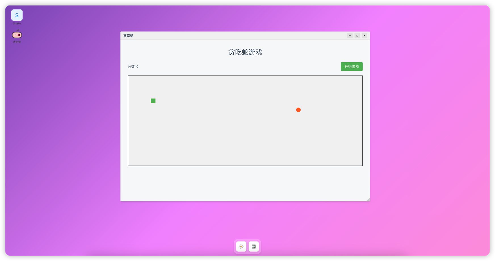

# zixin-windows

页面

## 预览地址

https://www.unuuc.cn [点我前往](https://unuuc/cn)

## 技术栈

### 核心依赖
- Vue 3 (v3.5.13)
- Pinia (v3.0.1) - 状态管理
- Vue Router (v4.5.0) - 路由管理

### 开发工具
- Vite (v6.2.1) - 构建工具
    - @vitejs/plugin-vue (v5.2.1)
    - vite-plugin-vue-devtools (v7.7.2)

## 核心文件 [windowManagerStore.js](src%2Fstores%2FwindowManagerStore.js)
### 状态管理
- **`windows`**: 存储所有窗口对象的响应式数组
- **`maxZIndex`**: 记录当前最大z-index值的变量

### 核心方法

#### 1. 窗口层级管理
`updateMaxZIndex()`
- 功能：更新当前最大z-index值
- 实现：遍历所有窗口找出最大的z-index值

`bringToFront(windowId)`
- 功能：将指定窗口置顶
- 参数：
    - `windowId`: 要置顶的窗口ID
- 流程：
    1. 更新当前最大z-index
    2. 找到对应窗口并将其z-index设为`maxZIndex + 1`

#### 2. 窗口可见性控制
`hideWindow(windowId)`
- 功能：隐藏指定窗口
- 参数：
    - `windowId`: 要隐藏的窗口ID
- 实现：将窗口的`visible`属性设为`false`

`restoreWindow(windowId)`
- 功能：恢复显示隐藏的窗口
- 参数：
    - `windowId`: 要恢复的窗口ID
- 流程：
    1. 将窗口的`visible`属性设为`true`
    2. 自动调用`bringToFront`将其置顶

#### 3. 窗口生命周期管理
 `openWindow(component, componentProps, title, iconComponent)`
- 功能：创建/打开新窗口
- 参数：
    - `component`: 窗口内容组件
    - `componentProps`: 传递给组件的属性（默认空对象）
    - `title`: 窗口标题（默认"新窗口"）
    - `iconComponent`: 可选的图标组件
- 特性：
    - 使用`markRaw`避免组件被响应式代理
    - 自动检测重复窗口（相同组件+相同属性）
    - 新窗口默认位置和大小（1100×750）
    - 自动递增z-index保证新窗口在最前
- 返回值：新窗口的ID

 `closeWindow(windowId)`
- 功能：完全关闭窗口
- 参数：
    - `windowId`: 要关闭的窗口ID
- 实现：从`windows`数组中移除对应窗口

### 辅助特性
- ​**防重复机制**：`openWindow`会检查是否存在相同组件和属性的可见窗口
- ​**智能定位**：新窗口位置会根据已有窗口数量自动偏移(30px步长)
- ​**图标支持**：可选接收`iconComponent`参数用于窗口图标

## 快速开始

```sh
yarn
```

### Compile and Hot-Reload for Development

```sh
yarn dev
```

### Compile and Minify for Production

```sh
yarn build
```
