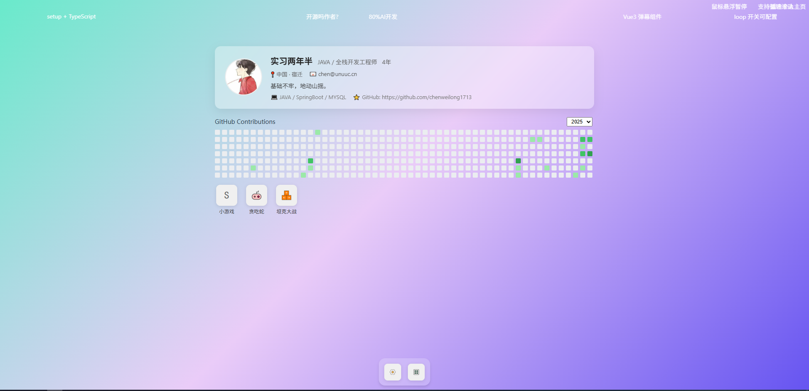

# zixin-windows 个人主页



这是一个具有Windows桌面风格的个人主页项目，集成了个人信息展示、GitHub贡献图以及多个小游戏等功能。

## 预览地址

https://www.unuuc.cn [点我前往](https://unuuc.cn)

## 项目特色

- 🖥️ Windows桌面风格界面，支持窗口拖拽、最小化、关闭等操作
- 👤 个人信息展示，包含头像、职业、技能等详细信息
- 📊 GitHub贡献图，展示代码贡献情况
- 🎮 内置多款经典小游戏（贪吃蛇、坦克大战、弹球等）
- 💬 实时弹幕功能，增强互动体验
- 🎨 现代化UI设计，使用毛玻璃效果和渐变背景

## 技术栈

### 核心依赖
- Vue 3 (v3.5.13)
- Pinia (v3.0.1) - 状态管理
- Vue Router (v4.5.0) - 路由管理
- TypeScript - 类型安全

### 开发工具
- Vite (v6.2.1) - 构建工具
  - @vitejs/plugin-vue (v5.2.1)
  - vite-plugin-vue-devtools (v7.7.2)

## 核心功能

### 1. 窗口管理系统
项目采用基于Pinia的状态管理实现窗口系统，核心文件为 [windowManagerStore.js](src%2Fstores%2FwindowManagerStore.js)

#### 状态管理
- **`windows`**: 存储所有窗口对象的响应式数组
- **`maxZIndex`**: 记录当前最大z-index值的变量

#### 核心方法

##### 窗口层级管理
`updateMaxZIndex()`
- 功能：更新当前最大z-index值
- 实现：遍历所有窗口找出最大的z-index值

`bringToFront(windowId)`
- 功能：将指定窗口置顶
- 参数：
  - `windowId`: 要置顶的窗口ID
- 流程：
  1. 更新当前最大z-index
  2. 找到对应窗口并将其z-index设为`maxZIndex + 1`

##### 窗口可见性控制
`hideWindow(windowId)`
- 功能：隐藏指定窗口
- 参数：
  - `windowId`: 要隐藏的窗口ID
- 实现：将窗口的`visible`属性设为`false`

`restoreWindow(windowId)`
- 功能：恢复显示隐藏的窗口
- 参数：
  - `windowId`: 要恢复的窗口ID
- 流程：
  1. 将窗口的`visible`属性设为`true`
  2. 自动调用`bringToFront`将其置顶

##### 窗口生命周期管理
 `openWindow(component, componentProps, title, iconComponent)`
- 功能：创建/打开新窗口
- 参数：
  - `component`: 窗口内容组件
  - `componentProps`: 传递给组件的属性（默认空对象）
  - `title`: 窗口标题（默认"新窗口"）
  - `iconComponent`: 可选的图标组件
- 特性：
  - 使用`markRaw`避免组件被响应式代理
  - 自动检测重复窗口（相同组件+相同属性）
  - 新窗口默认位置和大小（1100×750）
  - 自动递增z-index保证新窗口在最前
- 返回值：新窗口的ID

 `closeWindow(windowId)`
- 功能：完全关闭窗口
- 参数：
  - `windowId`: 要关闭的窗口ID
- 实现：从`windows`数组中移除对应窗口

### 2. 个人信息展示
- 用户头像、昵称、职业信息
- 技能标签展示
- GitHub链接
- 个人签名

### 3. GitHub贡献图
展示用户在GitHub上的代码贡献情况

### 4. 内置小游戏
- 贪吃蛇游戏
- 弹球游戏
- 坦克大战游戏

### 5. 弹幕系统
实时弹幕功能，增强页面互动性

## 快速开始

```sh
pnpm install
```

### Compile and Hot-Reload for Development

```sh
pnpm dev
```

### Compile and Minify for Production

```sh
pnpm build
```

## 项目结构

```
src/
├── api/                 # API接口
├── apps/                # 应用程序（小游戏等）
├── assets/              # 静态资源
├── components/          # 公共组件
├── router/              # 路由配置
├── stores/              # 状态管理
├── types/               # 类型定义
├── utils/               # 工具函数
└── views/               # 页面视图
    └── home/            # 主页视图
```

## 功能组件

- **UserProfileCard**: 用户信息展示卡片
- **GithubContributionGraph**: GitHub贡献图
- **DraggableModal**: 可拖拽窗口组件
- **TabBar**: 底部任务栏
- **Barrage**: 弹幕组件
- **MenuIcon**: 菜单图标组件

## 开发说明

该项目使用Vue 3 Composition API，结合Pinia进行状态管理，实现了完整的桌面风格UI体验。所有窗口都支持拖拽、置顶、最小化和关闭功能。

## 部署

项目构建后可部署到任何支持静态文件托管的平台，如GitHub Pages、Vercel、Netlify等。
